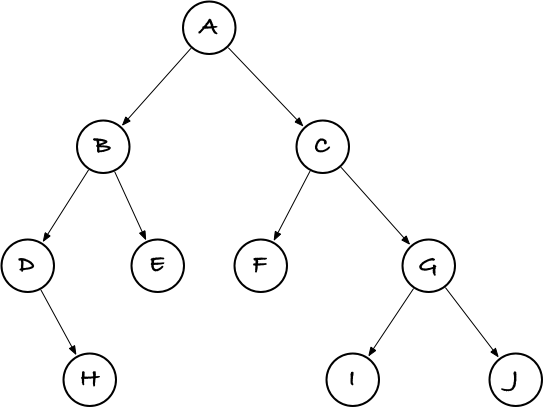
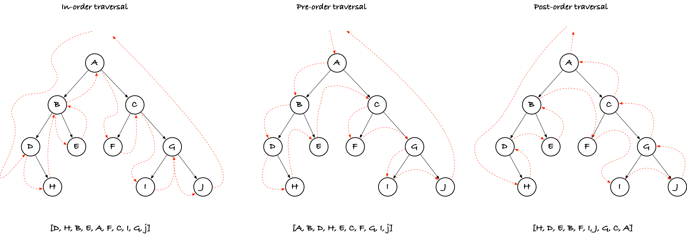
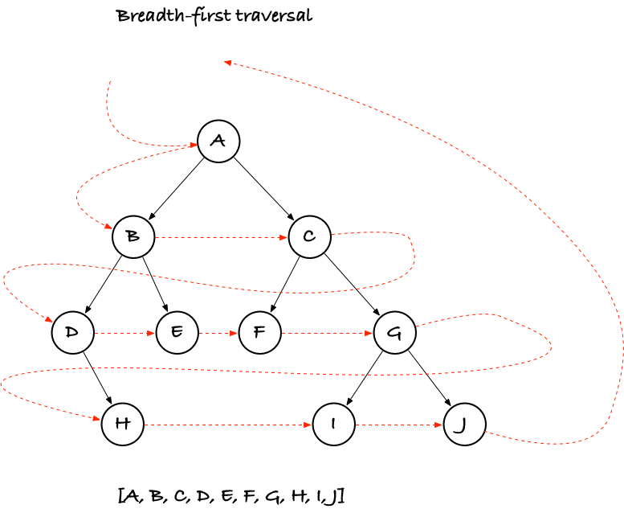

[](https://classroom.github.com/online_ide?assignment_repo_id=8562584&assignment_repo_type=AssignmentRepo)
# Traversing trees

A traversal of a tree is generally considered a tour through all the nodes. You do this for various reasons and you sometimes need to do visit the nodes in different orders.

Consider this tree:



It is just a tree; it happens to be binary but usually that isn't so important. The nodes are labelled `A` to `J`, but you can imagine that there is some interesting data in it.

Three different traversals are frequently used: in-order, pre-order, and post-order.



With in-order traversal you first visit the left child, then the node, and then the right child

```python
def in_order(v):
    in_order(v.left)
    visit(v)
    in_order(v.right)
```

With pre-order you visit the node before the children

```python
def pre_order(v):
    visit(v)
    pre_order(v.left)
    pre_order(v.right)
```

and with post-order you visit the children before the node

```python
def post_order(v):
    post_order(v.left)
    post_order(v.right)
    visit(v)
```

The in-order traversal is only defined (this way, at least) for binary trees, but the other two trivially generalises to arbitrary degrees.

These three traversal orders are all *depth-first traversals* because they go down an entire sub-tree before you move from a node to its siblings. They are easy to implement as recursive functions and equally easy to implement using an explicit stack.

## Depth-first traversal

In the exercise code, there is templates for constructing binary trees. You should write an in-order traversal function for these.

You can start with a recursive solution, like those above, but while this is the preferred way to introduce tree traversal in programming classes it has a serious drawback: your call stack is usually a limited resource. Very few languages will grow a call stack as needed (it is quite complicated to do that), so the stack you start out with is all you have. This is not a problem if you don't recurse that deep, but if you have a tree that is millions of nodes deep--and we might have such trees in string algorithms--then simple recursive functions are dead on arrival.

There is usually sufficient space on the heap, however, so an explicit stack can get you through a traversal where plain recursion can't.

(I say plain recursion here because you can also get around the problem with tail-recursion and continuations, but this is simply an implicit stack on the heap and amounts to the same thing.)

Try implementing your traversal using an explicit stack instead of recursive functions.

## Breadth-first traversal

Those aren't the only traversal orders, however. Another commone order is *breadth-first traversal* where you visit all nodes at the same level (distance from the root) before you move further down the tree.



In a breadth-first traversal you cannot use a recursive function or a stack.

What data structure do you need instead of a stack to do a breadth-first traversal?

Implement a breadth-first traversal so you get the hang of it.

